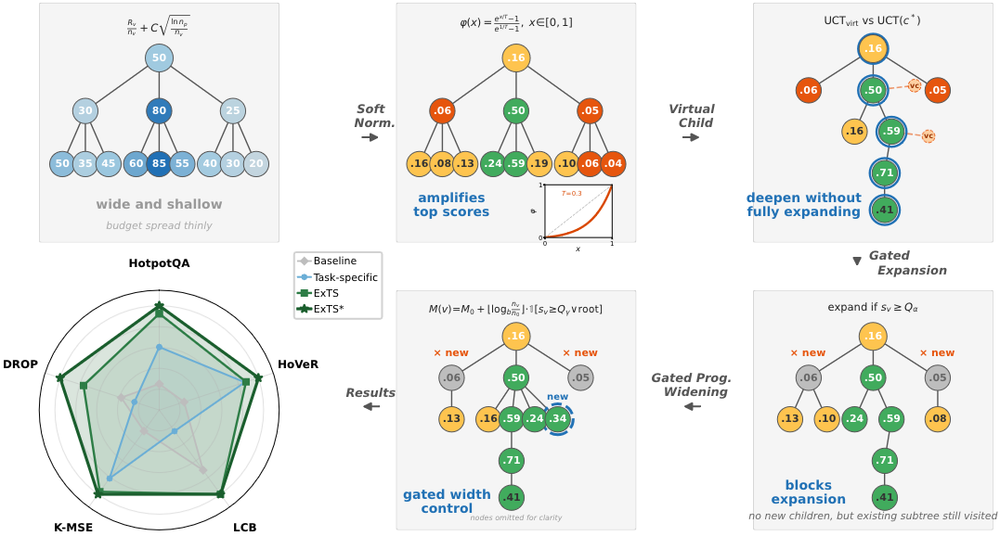
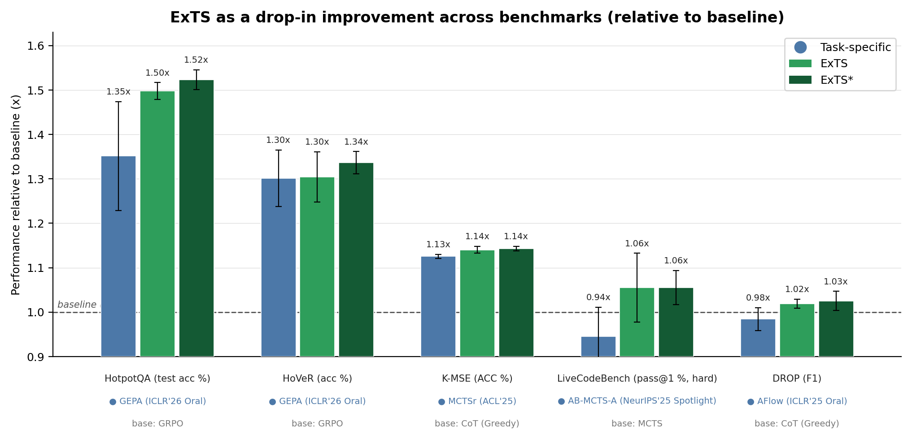

<div align="center">

# ExTS: Exploit More, Explore Smarter for Budget-Constrained Agentic Search

**A drop-in candidate-selection policy you can readily inject into existing agentic, tree-search, and evolutionary-search frameworks.**

[](https://arxiv.org/abs/2608.23848)
&nbsp;




</div>

ExTS is a Monte Carlo Tree Search (MCTS) **candidate-selection policy** for **budget-constrained agentic search**: systems that iteratively refine candidates under an expensive, noisy evaluation (an LLM call, a compilation, a full validation-set run) and must decide which candidate to expand next. It exploits strong candidates harder while exploring smarter, combining soft reward normalization, a failure-aware value, quantile-gated expansion with progressive widening, and an adaptive virtual-child rule that decides on the fly whether to **widen** (try a new sibling) or **deepen** (refine an existing one). Because ExTS is expressed as a small, self-contained selection contract, it drops into existing agentic, tree-search, and evolutionary-search frameworks with little or no change to their core code.

> Accepted to **EMNLP 2026 Findings**. Paper: *Exploit More, Explore Smarter for Budget-Constrained Agentic Search*, [arXiv:2608.23848](https://arxiv.org/abs/2608.23848).

## 📊 Performance



Across the paper's benchmarks, ExTS acts as an additional improvement layered on top of each task's harness. Each bar is a method's score relative to that dataset's baseline (baseline = 1.0x). Higher is better.

## 🔌 Drop-in Integration

The complete algorithm is a single, dependency-free file, **[`exts.py`](exts.py)** (standard library only). Copy it into your project and drive it from your search loop: `initialize_root -> select -> add_child -> backpropagate_success/failure -> sync_scores`.

ExTS is built to be **readily injected into an existing search framework with little or no core-code change.** The bundled Claude skill **[`skills/exts-integration`](skills/exts-integration)** walks an agent through three integration patterns: inject a selector object, drive a controller loop, or port ExTS to a host tree-search framework. The skill was verified end to end on the [`examples/gepa-lib`](examples/gepa-lib) integration: it injected ExTS into the production GEPA library with no changes to GEPA's core code, and on HotpotQA the resulting selector improved held-out exact match from 47.7% (±8.8, GEPA's evolutionary selector) to 51.3% (±0.6, ExTS), averaged over 3 seeds. The wide baseline spread comes from a single seed on which the evolutionary selector collapsed, so this small-scale result is illustrative of the integration working rather than a benchmark claim. Integration is not guaranteed to be perfect for an arbitrary codebase, so human review of the result is recommended.

## 🧩 Examples

Worked integrations live under [`examples/`](examples/): GEPA (paper artifact and production library), K-MSE, and TreeQuest / AB-MCTS. Each ships as a patch against a pinned upstream plus a fetch script.

## 📚 Citation

```bibtex
@article{fang2026exploit,
  title={Exploit More, Explore Smarter for Budget-Constrained Agentic Search},
  author={Fang, Haoyang and Wang, Bernie},
  journal={arXiv preprint arXiv:2608.23848},
  year={2026}
}
```
